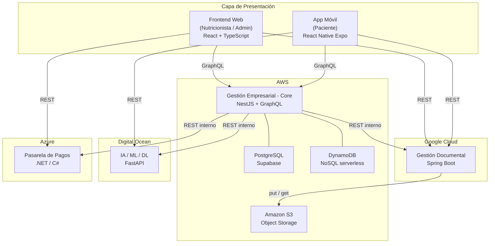

# División de la Capa de Presentación: Frontend Web vs App Móvil

## Contexto del sistema

El sistema **Vital Bite** es una plataforma multi-tenant para nutricionistas construida sobre **4 microservicios** desplegados en distintos proveedores cloud:

| # | Microservicio | Framework | Cloud | Responsabilidades |
|---|---|---|---|---|
| 1 | **Backend de Gestión Documental** | Spring Boot (Java) | Google Cloud | Generación de PDFs (dietas, reportes), almacenamiento en S3, entrega de documentos, blockchain para bitácora de auditorías |
| 2 | **Backend de Gestión Empresarial (Core)** | NestJS + GraphQL | AWS | Autenticación, multi-tenant, pacientes, citas, medidas corporales, dietas, automatización (bot WhatsApp, notificaciones), BI con DynamoDB |
| 3 | **Backend de IA / ML / DL** | FastAPI (Python) | Digital Ocean | OCR de etiquetas nutricionales (Deep Learning), predicción de riesgo nutricional (Random Forest), segmentación de pacientes (K-means) |
| 4 | **Backend de Pasarela de Pagos** | .NET / C# | Azure | Gestión de planes SaaS, procesamiento de pagos, suscripciones, webhooks de pasarela, facturación |

---

## Arquitectura general



---

## Distribución de responsabilidades por microservicio

### 1. Backend de Gestión Documental — Spring Boot / Google Cloud

Centraliza todo lo relacionado con documentos y trazabilidad inmutable:

- Generación de PDFs de dietas personalizadas
- Generación de PDFs de gráficas y reportes de seguimiento corporal
- **Almacenamiento en Amazon S3** (bucket compartido con el stack AWS): escritura de PDFs e imágenes OCR temporales, generación de presigned URLs para descarga directa por el cliente
- Entrega de PDFs al paciente (presigned URL vía descarga o envío automatizado)
- **Bitácora blockchain:** registro inmutable de accesos, modificaciones y transacciones del sistema

### 2. Backend de Gestión Empresarial (Core) — NestJS + GraphQL / AWS

Es el servicio central del sistema. Expone una API GraphQL consumida por ambos clientes:

- Autenticación y autorización (JWT, multi-tenant por `tenant_id`)
- Gestión de nutricionistas (perfiles, configuración de consultorio)
- Gestión de pacientes (registro, ficha clínica, historial)
- Gestión de citas (calendario, confirmación manual y automatizada)
- Registro de medidas corporales e indicadores (IMC, grasa, músculo, agua, etc.)
- Gestión de dietas (dieta reportada por el paciente + dieta generada por la nutricionista)
- Automatización: bot de WhatsApp para agendar citas, notificaciones push
- Business Intelligence: análisis de tendencias, reportes de cohortes (DynamoDB en AWS)
- Orquestación interna: invoca al Documental, al de IA y al de Pagos según corresponda

### 3. Backend de IA / ML / DL — FastAPI / Digital Ocean

Encapsula todos los modelos de inteligencia artificial:

- **OCR + Deep Learning:** extracción de valores nutricionales desde imágenes de etiquetas capturadas por la cámara del móvil
- **Random Forest:** predicción del riesgo nutricional del paciente (basado en hábitos, peso, edad, indicadores)
- **K-means:** segmentación de pacientes en clusters según patrones nutricionales similares

### 4. Backend de Pasarela de Pagos — .NET / C# / Azure

Microservicio dedicado exclusivamente al ciclo de vida financiero del SaaS:

- Gestión de planes disponibles (básico, profesional, enterprise)
- Procesamiento de pagos mediante integración con pasarela externa (Stripe, PayPal u otra)
- Gestión de suscripciones: altas, renovaciones, cancelaciones y cambios de plan
- Recepción y procesamiento de **webhooks** de la pasarela (pagos exitosos, fallidos, reembolsos)
- Emisión de facturas y comprobantes de pago
- Notificación al Core cuando una suscripción cambia de estado (activa, vencida, cancelada)
- Integración con blockchain (vía Documental) para registro inmutable de transacciones financieras

---

## Almacenamiento de datos

El sistema requiere un mínimo de **2 bases de datos** y **1 capa de almacenamiento de objetos**:

### Resumen

| # | Tecnología | Tipo | Hospedado en | Microservicio que la usa | Datos que almacena |
|---|---|---|---|---|---|
| 1 | **PostgreSQL (Supabase)** | Relacional | AWS (Supabase cloud) | Core, Pagos | Toda la data transaccional del negocio y el historial financiero |
| 2 | **DynamoDB** | NoSQL serverless | AWS | Core | Eventos de BI, métricas de alto volumen, analytics |
| 3 | **Amazon S3** | Object storage | AWS | Documental | PDFs de dietas y reportes de seguimiento, imágenes OCR temporales |

> S3 no es una base de datos, pero es la capa de persistencia obligatoria para todos los documentos generados por el sistema.

---

### PostgreSQL vía Supabase — data transaccional del Core

Es la base de datos principal del sistema. Concentra toda la información estructurada y relacional:

```
-- Tablas propias del Core
nutricionistas       → perfil, tenant_id, estado de suscripción (sincronizado desde Pagos)
pacientes            → datos básicos, alergias, vinculación al tenant
citas                → fecha, hora, estado, paciente, nutricionista
medidas_corporales   → por consulta: brazo, pierna, abdomen, IMC, grasa, músculo, agua, etc.
dietas               → dieta reportada y dieta generada, vinculada a paciente y cita
dieta_items          → alimentos por tiempo de comida (desayuno, almuerzo, cena, merienda)
documentos           → metadatos de PDFs (URL en S3, tipo, paciente, fecha)
audit_log            → referencia al hash blockchain del evento

-- Tablas propias del servicio de Pagos (esquema separado en el mismo PostgreSQL o BD propia)
planes_saas          → definición de los planes (básico, profesional, etc.) y precios
suscripciones        → plan activo por nutricionista, fechas, estado
pagos                → historial de transacciones, referencia de pasarela, estado
facturas             → comprobantes emitidos por ciclo de facturación
```

Supabase aporta además: **autenticación integrada**, **Row Level Security (RLS)** para aislar datos por `tenant_id` entre nutricionistas, y **acceso en tiempo real** para notificaciones.

---

### DynamoDB — BI y eventos de alto volumen

Base de datos NoSQL serverless de AWS, usada para datos que no encajan bien en el modelo relacional por su volumen o frecuencia de escritura:

```
metricas_indicadores   → evolución histórica de IMC, grasa, músculo por paciente (series de tiempo)
eventos_sistema        → clicks, vistas de pantalla, acciones del usuario (analytics de uso)
tendencias_nutricionales → agregados por cohorte, período, tipo de dieta
resultados_ml          → salida de Random Forest y K-means por paciente y fecha de cálculo
```

La naturaleza **serverless** de DynamoDB elimina la necesidad de gestionar infraestructura para picos de carga en los módulos de BI.

---

### Amazon S3 — almacenamiento de objetos

Almacena todos los archivos binarios generados o procesados por el sistema:

```
/pdfs/dietas/{tenant_id}/{paciente_id}/{fecha}.pdf
/pdfs/reportes/{tenant_id}/{paciente_id}/{fecha}.pdf
/ocr/imagenes/{sesion_id}.jpg          ← temporales, se eliminan tras procesar
```

El Backend Documental (Spring Boot) es el único que escribe y lee directamente en S3. Los demás servicios reciben URLs prefirmadas (presigned URLs) para que el cliente descargue el archivo sin pasar por el backend.

---

## Frontend Web — Panel Administrativo (Nutricionista)

**Stack:** React + TypeScript + Apollo Client  
**Audiencia:** Nutricionista y administradores del consultorio  
**Backends consumidos:** Core (GraphQL), Documental (REST), Pagos (REST)

### Módulos y pantallas

#### Autenticación y onboarding
- Login y registro de la nutricionista (Core)
- Selección de plan SaaS y proceso de pago (Pasarela de Pagos)
- Configuración de perfil y datos del consultorio (Core)
- Gestión del plan activo, historial de pagos y facturas (Pasarela de Pagos)

#### Dashboard principal
- Resumen de citas del día y la semana
- Alertas de pacientes con riesgo nutricional elevado (resultado del modelo Random Forest, servido por Core)
- KPIs: total de pacientes activos, citas del mes, dietas generadas, PDFs enviados

#### Gestión de pacientes
- Listado con búsqueda y filtros
- Registro de nuevo paciente (nombre, apellido, altura, alergias, datos de la primera consulta)
- Ficha clínica completa con historial de citas y medidas
- Vista de segmentación de pacientes por clusters K-means

#### Gestión de citas
- Calendario de disponibilidad con vista semanal y mensual
- Creación manual de citas y confirmación de solicitudes
- Estado del bot de WhatsApp (citas automatizadas)
- Historial de consultas por paciente

#### Medidas corporales
- Formulario de registro por consulta: brazo, antebrazo, pierna, abdomen, etc.
- Indicadores calculados: IMC, grasa corporal, grasa visceral, masa ósea, masa muscular, % de agua
- Gráficas de evolución temporal por indicador

#### Gestión de dietas
- Registro de la dieta actual reportada por el paciente (desayuno, almuerzo, cena, meriendas)
- Formulario para crear la dieta personalizada
- Previsualización antes del envío
- Generación automática del PDF (Core orquesta al Documental) y envío al paciente

#### Reportes y documentos
- Historial de PDFs generados por paciente (dietas y reportes de seguimiento)
- Descarga y reenvío manual

#### Business Intelligence
- Reportes de tendencias nutricionales por período
- Análisis de composición corporal por cohortes (DynamoDB vía Core)

#### Auditoría
- Vista de bitácora inmutable: accesos, modificaciones, transacciones
- Filtros por tipo de evento, usuario y rango de fechas
- Datos servidos desde el Documental (blockchain)

---

## App Móvil — Vista del Paciente

**Stack:** React Native (Expo)  
**Audiencia:** Pacientes vinculados a una nutricionista  
**Backends consumidos:** Core (GraphQL), IA/ML (REST), Documental (REST)  
**Capacidades nativas:** cámara, OCR, autenticación biométrica (huella digital), push notifications

### Módulos y pantallas

#### Autenticación
- Login con correo y contraseña
- Autenticación biométrica con huella digital (API nativa del dispositivo)
- Vinculación al consultorio de la nutricionista (multi-tenant via `tenant_id`)

#### Dashboard del paciente
- Próxima cita agendada con fecha, hora y estado
- Gráfica resumida del progreso de peso e IMC
- Acceso rápido a la dieta activa

#### Mis citas
- Lista de citas confirmadas y pendientes
- Solicitar nueva cita (redirige al bot de WhatsApp del consultorio)
- Historial de consultas anteriores

#### Mi dieta
- Visualización de la dieta vigente asignada por la nutricionista
- Desglose por comida: desayuno, almuerzo, cena, meriendas
- Descarga del PDF desde el Documental

#### Escáner nutricional *(funcionalidad exclusiva de la app móvil)*
- Activación de la cámara para capturar la etiqueta de un producto
- Envío de la imagen al Backend de IA (OCR + Deep Learning)
- Visualización del resultado: calorías, macronutrientes e ingredientes

#### Mi progreso
- Gráficas interactivas de evolución de medidas corporales por fecha
- Historial de indicadores: IMC, grasa corporal, masa muscular, % de agua
- Descarga de PDFs de seguimiento desde el Documental

#### Notificaciones
- Recordatorios de próximas citas (push notifications vía Core)
- Alertas de nuevas dietas asignadas
- Notificaciones de PDFs disponibles

---

## Mapa de distribución de funcionalidades

| Funcionalidad | Frontend Web | App Móvil | Microservicio |
|---|:---:|:---:|---|
| Login / Registro | ✓ | ✓ | Core |
| Autenticación biométrica | — | ✓ | Core + nativo |
| Dashboard con KPIs | ✓ | — | Core |
| Dashboard del paciente | — | ✓ | Core |
| Gestión de pacientes | ✓ | — | Core |
| Gestión de citas (admin) | ✓ | — | Core |
| Ver / solicitar citas (paciente) | — | ✓ | Core |
| Registro de medidas corporales | ✓ | — | Core |
| Ver progreso corporal | — | ✓ | Core |
| Crear dieta personalizada | ✓ | — | Core |
| Ver dieta asignada | — | ✓ | Core |
| Escáner nutricional (OCR + DL) | — | ✓ | IA/ML/DL |
| Riesgo nutricional (Random Forest) | ✓ | — | IA/ML/DL |
| Segmentación K-means | ✓ | — | IA/ML/DL |
| Generación de PDFs | ✓ | — | Documental |
| Descargar PDFs recibidos | — | ✓ | Documental |
| Business Intelligence | ✓ | — | Core (DynamoDB) |
| Auditoría / Blockchain | ✓ | — | Documental |
| Gestión de plan SaaS y pagos | ✓ | — | Pagos (.NET) |
| Push notifications | — | ✓ | Core |
| Bot WhatsApp (automatización) | ✓ (vista) | ✓ (uso) | Core |

---

## Consideraciones técnicas

- El **Core (NestJS + GraphQL)** es el único backend expuesto directamente a ambos clientes via GraphQL. Actúa además como orquestador interno, delegando al Documental la generación de PDFs, al de IA las predicciones y al de Pagos todo el ciclo financiero.
- El **Backend de Pagos (.NET / C#)** es invocado directamente desde el Frontend Web para el onboarding y gestión del plan. El Core lo consulta internamente para verificar el estado de la suscripción antes de permitir operaciones. Se recomienda **Azure** como proveedor por ser el ecosistema natural de .NET.
- El **Backend de IA** es invocado directamente desde la app móvil solo para el escáner en tiempo real. Las predicciones de riesgo y segmentación son precalculadas por el Core y servidas como campos del esquema GraphQL.
- El **Backend Documental** centraliza toda la generación y entrega de archivos. Los clientes nunca reciben el binario directamente desde el backend: el Documental genera una **presigned URL de S3** con tiempo de expiración y la entrega al cliente para descarga directa. También recibe notificaciones del servicio de Pagos para registrar transacciones financieras en la bitácora blockchain.
- La **bitácora blockchain** vive en el Documental (Spring Boot) y solo es visible desde el panel web; el paciente no tiene acceso a los registros de auditoría.
- El modelo **multi-tenant** se implementa en el Core: el JWT incluye el `tenant_id` del consultorio y todos los resolvers GraphQL filtran los datos por ese identificador. Supabase RLS refuerza este aislamiento a nivel de base de datos.
- **PostgreSQL (Supabase)** cubre toda la data transaccional. El servicio de Pagos puede usar el mismo PostgreSQL en un esquema separado (`payments`) o una instancia propia, según el nivel de aislamiento deseado. **DynamoDB** se usa exclusivamente para datos de alto volumen y analytics.
- Las **capacidades nativas** (cámara, huella digital, push notifications) no tienen equivalente web y son gestionadas por librerías de Expo en la app móvil.
